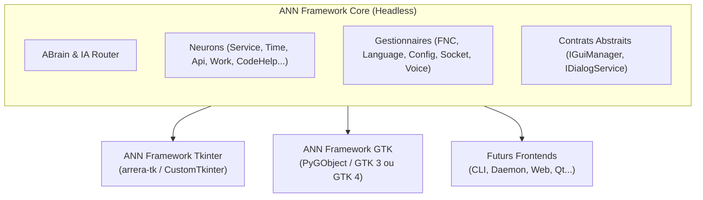
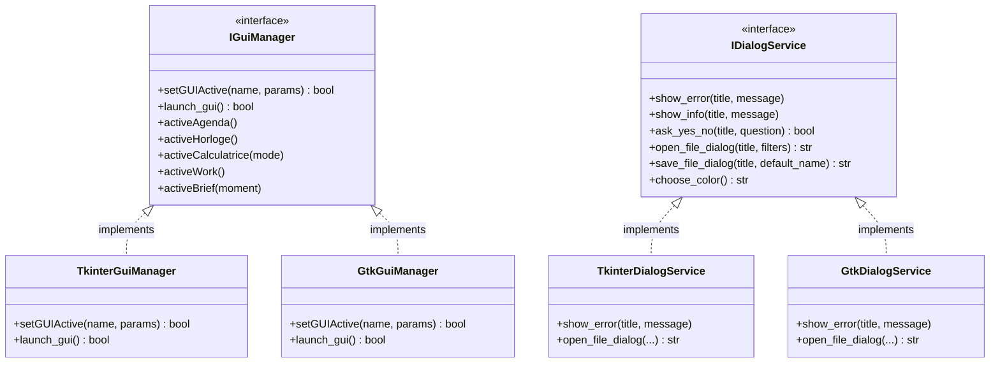

# Architecture Modulaire : Arrera Neuron Network (ANN)

Ce document présente la stratégie de refonte et de modularisation du projet **Arrera Neuron Network** en séparant le moteur logique (*Headless Core*) des couches de présentation graphique (*Frontends Tkinter et GTK*).

---

## 1. Vision Globale & Objectifs

L'objectif est de découpler totalement la logique métier, l'IA et le traitement de données des technologies d'interface utilisateur (GUI). 



### Avantages Majeurs
- **Indépendance vis-à-vis de l'environnement d'exécution** : Le cœur du framework peut tourner sans serveur d'affichage (serveur distant, mode vocal pur, démon système, scripts CLI).
- **Maintenance centralisée** : Toute amélioration du cerveau IA, de la détection de mots-clés ou de la logique métier profite immédiatement à toutes les interfaces.
- **Flexibilité & Évolutivité** : Possibilité d'ajouter n'importe quelle technologie d'affichage (Web, Qt, Mobile) sans toucher au cœur.
- **Facilité de test** : Tests unitaires et d'intégration exécutables sans initialiser de boucle d'événements graphique.

---

## 2. Découpage en 3 Modules

### A. `ANN-Core` *(Moteur Métier & IA - Zéro Dépendance GUI)*
Le noyau contient toute l'intelligence et les services d'Arrera :
* **Composants** :
  * `brain/` : Boucle principale d'inférence, file de messages, orchestration des neurones.
  * `neuron/` : Routeurs IA, analyse syntaxique, classification des intentions.
  * `fnc/` : Logique applicative (Calculatrice, Horloge, Météo, Agenda, Traduction, Actualités, etc.).
  * `config/` & `language/` : Configuration du système et dictionnaires linguistiques.
  * `gestionnaire/` : Gestionnaires métier (`gestFNC`, `gestUserSetting`, `gestLanguage`, etc.).
* **Contrats d'abstraction** :
  * `IGuiManager` : Interface abstraite définissant toutes les actions graphiques déclenchables (`open_agenda()`, `open_calculator()`, `show_brief()`, etc.).
  * `IDialogService` : Interface abstraite pour les popups système (`show_error()`, `show_info()`, `ask_yes_no()`, `select_file()`, `select_color()`).
* **Dépendances** : `llama_cpp_python`, `requests`, `numpy`, `sounddevice`, `piper-tts`, `speechRecognition`, etc. (**Aucune dépendance à Tkinter ou GTK**).

---

### B. `ANN-Tkinter` *(Frontend Desktop Tkinter)*
Implémentation de l'interface basée sur la pile technologique actuelle :
* **Composants** :
  * `TkinterGuiManager` (implémente `IGuiManager`).
  * `TkinterDialogService` (implémente `IDialogService`).
  * Toutes les fenêtres existantes dans `gui/` ([GUIAgenda.py](file:///Users/baptistep/Documents/developpement/ArreraNeuronNetwork/gui/GUIAgenda.py), [GUICalculatrice.py](file:///Users/baptistep/Documents/developpement/ArreraNeuronNetwork/gui/GUICalculatrice.py), [GUIArreraWork.py](file:///Users/baptistep/Documents/developpement/ArreraNeuronNetwork/gui/GUIArreraWork.py), etc.).
  * Interface principale Opale en version Tkinter.
* **Dépendances** : `ANN-Core`, `arrera-tk`, `customtkinter`, `pillow`.

---

### C. `ANN-GTK` *(Frontend Desktop GTK)*
Nouvelle implémentation moderne basée sur GTK :
* **Composants** :
  * `GtkGuiManager` (implémente `IGuiManager`).
  * `GtkDialogService` (implémente `IDialogService` via `Gtk.MessageDialog` et `Gtk.FileChooserNative`).
  * `GuiBaseGTK` : Classe de base pour la gestion des fenêtres GTK, thèmes CSS et cycle de vie.
  * Réécriture des fenêtres applicatives en GTK (ou chargement via `Gtk.Builder` / fichiers `.ui`).
  * Interface principale Opale en version GTK.
* **Gestion du multithreading** : Synchronisation des réponses IA et événements d'arrière-plan avec la boucle GTK via `GLib.idle_add()`.
* **Dépendances** : `ANN-Core`, `PyGObject` (GTK 3 ou GTK 4 / Libadwaita).

---

## 3. Gestion des Dépendances & Abstractions

### Diagramme de Classes des Contrats



---

## 4. Plan de Migration par Étapes

```mermaid
timeline
    title Feuille de Route de la Modularisation
    section Étape 1 : Assainissement du Core
      Extraction des imports Tkinter hors de fnc/ et objet/ : Création de IDialogService
      Définition des interfaces IGuiManager & IDialogService : Isolation du package Core
    section Étape 2 : Création de ANN-Tkinter
      Création de TkinterGuiManager : Déplacement des GUI existantes vers le module Tkinter
      Validation que le Core fonctionne avec ANN-Tkinter : Tests de régression
    section Étape 3 : Création de ANN-GTK
      Mise en place de PyGObject & GuiBaseGTK : Développement du GtkDialogService
      Développement de GUIOpale en GTK : Migration progressive des fenêtres secondaires
    section Étape 4 : Déploiement & Packaging
      Création des packages pip/wheel : Fichiers .spec PyInstaller dédiés pour Tkinter et GTK
```

### Détail des Phases :

1. **Étape 1 : Extraction & Assainissement du Core**
   - Identifier et retirer les imports directs de `tkinter` résiduels dans le moteur logique (ex: `fnc/fonctionArreraWork.py`, `objet/CArreraDownload.py`).
   - Remplacer ces appels par des appels à `gest.getDialogService()`.
   - Remplacer [gestGUI.py](file:///Users/baptistep/Documents/developpement/ArreraNeuronNetwork/gestionnaire/gestGUI.py) par l'interface abstraite `IGuiManager`.

2. **Étape 2 : Empaquetage de ANN-Tkinter**
   - Regrouper le dossier `gui/` et les wrappers `arrera_tk` dans un sous-projet ou package dédié `ann_tkinter`.
   - Fournir l'implémentation concrète `TkinterGuiManager` au gestionnaire principal.
   - S'assurer que le fonctionnement existant est 100% conservé.

3. **Étape 3 : Développement de ANN-GTK**
   - Créer le module `ann_gtk`.
   - Mettre en place `GuiBaseGTK` pour gérer les fenêtres, le style CSS et la compatibilité thread (`GLib.idle_add`).
   - Implémenter la fenêtre principale Opale en GTK.
   - Implémenter les interfaces secondaires une à une (Calculatrice, Horloge, Agenda, Météo, etc.).

4. **Étape 4 : Validation & Packaging**
   - Permettre de lancer l'application en choisissant le backend (`python main.py --ui=gtk` ou `python main.py --ui=tkinter` ou `python main.py --headless`).
   - Configurer les scripts de compilation et dépendances pour chaque distribution.
